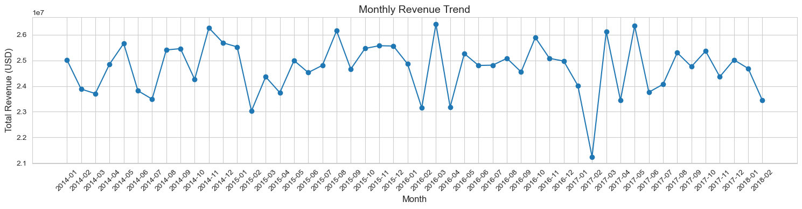
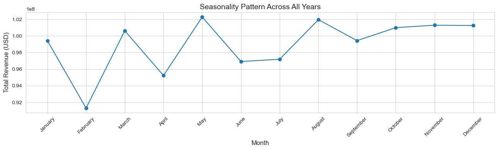
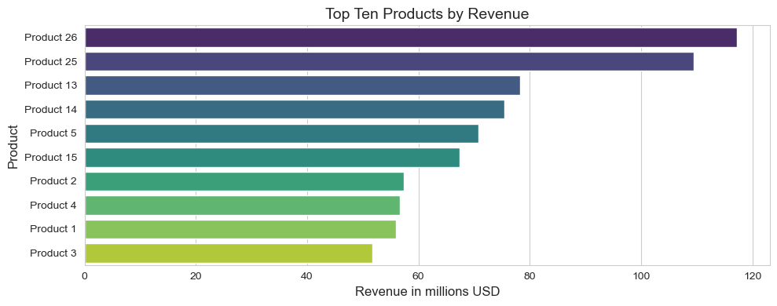
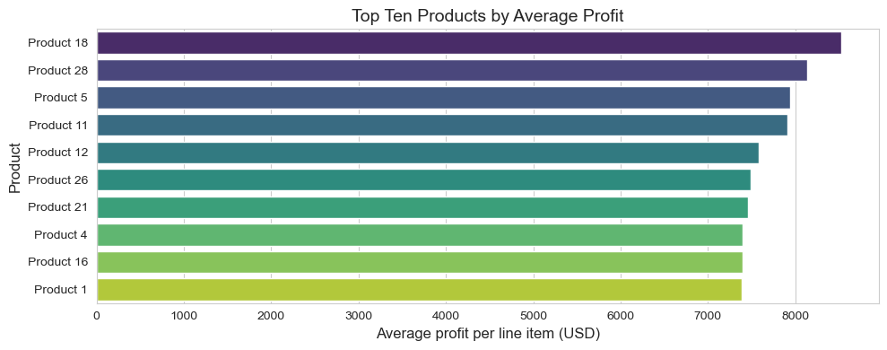
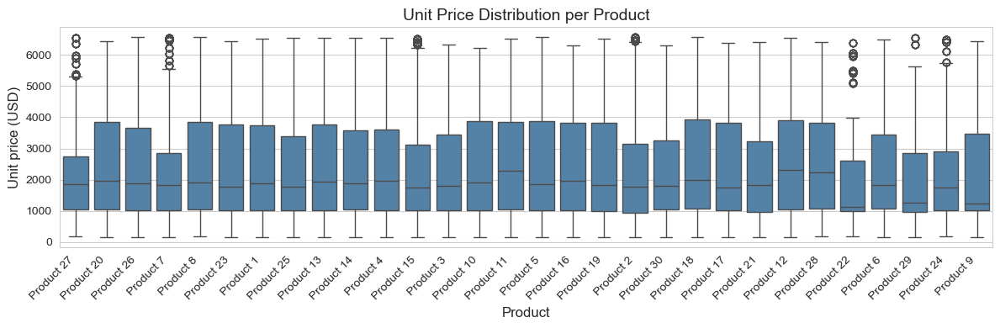
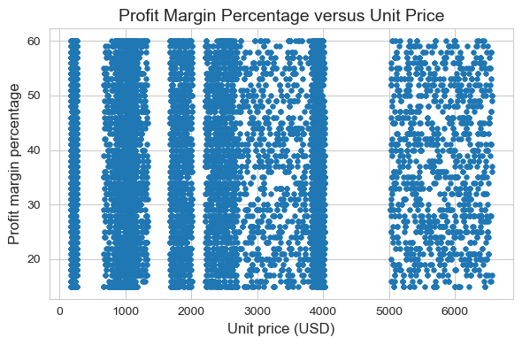

# USA Regional Sales Analysis using Python

## Project Overview

FluxWare Retail Systems is a United States based distributor supplying consumer goods to wholesale, retail, and export partners across multiple regions. The company maintains a diverse product catalog and records every transaction at the order line level.

Business leadership requested a data driven exploratory analysis to understand sales trends, product performance, regional contribution, customer concentration, and profitability behaviour using several years of historical sales records.

## Business Objectives

FluxWare Retail Systems requested an exploratory data analysis to support strategic decision making across sales, product management, and regional operations. The analysis focuses on the following objectives:

- Identify monthly revenue patterns and detect seasonal trends
- Evaluate individual product performance and contribution to total revenue
- Analyze sales mix across channels including Wholesale, Distributor, and Export
- Assess regional and state level sales performance
- Profile customer revenue distribution and identify high value segments
- Examine profit and pricing behaviour across products and regions

## Data Summary

The analysis is based on six source tables provided in a structured Excel workbook containing sales, customer, product, regional, and budget information.

### Source Tables

- Sales Orders
- Customers
- Products
- Regions
- State Regions
- 2017 Budgets

### Final Analysis Grain

Each row in the final analysis ready dataset represents:
one product line within a single customer order, enriched with customer details, geographic attributes, and profit calculations.

### Entity Relationship Diagram (ERD)

The data model includes relationships across customers, products, regions, and state level attributes.
The ERD below summarizes key joins used to create the unified dataset.

## Executive Summary

The analysis of FluxWare Retail Systems’ historical sales data reveals stable revenue performance, strong product concentration, and clear regional patterns. Customer revenue distribution shows a wide spread between high value and low value accounts, while profit margins remain consistent across most customer tiers. Product mix and channel contribution also highlight opportunities for targeted optimization.

Key findings include:

- Revenue stability across years:

  - Monthly revenue remained within a narrow range of approximately $23M–$26.5M, indicating predictable demand with no clear recurring seasonal peaks. A noticeable dip occurred in early 2017, suggesting a one time operational or market disruption.

- Top products drive a significant share of revenue

  - High performing items such as Product 26, Product 25, and Product 13 consistently generated the largest revenue totals. Mid range products showed steady performance, while the lowest tier products contributed approximately $52M–$57M each.

- Channel mix is dominated by Wholesale

  - Wholesale accounted for the majority of revenue, followed by Distributor and Export channels. Expanding export partnerships represents a potential growth path.

- Regional concentration is strong

  - States such as California, Illinois, Florida, and Texas contributed the highest revenue levels and largest order volumes. Northeast and Midwest states showed stable but lower overall activity.

- Customer segments show predictable margin behavior
  - Despite revenue differences, profit margins across customer tiers remained within a relatively stable band (~34–40%), indicating standardized pricing and cost structures. Smaller accounts showed slightly higher margin volatility.

## Detailed Insights

### Sales Trends

Monthly revenue patterns were evaluated across four years of data. Revenue remained stable within a narrow band for most periods, showing no strong recurring seasonality. A visible dip occurred in early 2017, which may indicate a temporary operational or market disruption. Overall, the company demonstrates consistent sales volume and predictable month to month fluctuations.

**Key observations:**

- Revenue generally ranged between $23M and $26.5M per month
- No clear seasonal peaks, though a small uptick appears between May and June in multiple years
- Early 2017 shows the lowest revenue point in the dataset (≈$21.2M)
- Order volumes followed a similar non seasonal pattern

**Charts to include:**

#### Monthly Revenue Trend

#### Monthly Seasonality (All Years Combined)

### Product Performance

Product level analysis reveals a clear concentration of revenue among the top performing items. A small set of products consistently dominates total sales, while mid tier and lower tier items contribute steadily but at smaller scales. Profit margin behavior remains relatively consistent across the catalog, indicating standardized pricing and cost models.

**Key Observations:**

- Product 26, Product 25, and Product 13 generated the highest total revenue, each exceeding $75M
- The bottom tier products still produced $52M–$57M each, reflecting a relatively balanced long tail
- Average profit per product shows a similar ranking, with top products leading both revenue and profitability
- No strong correlation was observed between unit price and profit margin percentage
- Pricing appears consistent, as profit margins cluster around 35–40 percent across most products

**Charts to include:**

#### Top 10 Products by Revenue

#### Top 10 Products by Average Profit

#### Unit Price Distribution by Product

#### Profit Margin Percentage vs Unit Price

### Sales Channels

FluxWare Retail Systems generates the majority of its revenue through the Wholesale channel, followed by Distributor and Export partners. The distribution of revenue and profit across these channels indicates clear operational strengths and potential opportunities for channel expansion.

**Key Observations:**

- Wholesale accounts for the largest share of total revenue (more than half of all sales)
- Distributor represents the second largest channel with steady contribution across all years
- Export, while the smallest channel, shows meaningful revenue volume and potential for international growth
- Profitability across channels follows a similar hierarchy, with Wholesale leading both total revenue and total profit
- Average order value remains highest in Wholesale and Export, while Distributor handles higher order counts

**Charts to include:**

- Revenue by channel
- Profit by channel
- Channel order volume comparison

### Regional Performance

Regional and state level analysis highlights strong geographic concentration in a few key markets. Revenue and order volume are not evenly distributed across the country, indicating clear clusters of high performing states that drive the majority of sales. These patterns reveal where FluxWare Retail Systems maintains its strongest customer presence and where additional market development could be explored.

**Key observations:**

- California leads all states in both revenue and order volume, contributing more than $200M alone
- Other high performing states include Illinois, Florida, and Texas, each generating $85M–$110M in revenue
- States in the Northeast and Midwest show moderate performance but lower total order volumes
- Revenue distribution across US regions shows West and South as the strongest markets
- Geographic patterns align with population density and customer distribution

**Charts to include:**

- Total revenue by US region
- Total revenue by state
- Top 10 states by revenue
- Top 10 states by order volume

### Customer Insights

Customer level analysis shows a wide distribution of revenue contribution across the portfolio. A small group of high value customers generates a significant share of total revenue, while the remaining customer base contributes steadily at lower volumes. Despite these differences, profit margins remain relatively stable across most customer tiers, reflecting consistent pricing practices and cost structures.

**Key observations:**

- High value customers contribute more than $10M each in total revenue and exhibit stable profit margins between 36–40 percent
- Mid tier customers in the $6M–$10M range show consistent purchasing patterns and margin behaviour
- Lower tier customers (below $6M) display the widest variance in profit margins, suggesting greater sensitivity to pricing or cost fluctuations
- Order count increases with customer revenue, but margin levels remain stable across segments
- Revenue distribution is positively skewed, indicating reliance on a limited number of top performing customers

**Charts to include:**

- Customer revenue distribution
- Customer segmentation scatter or bubble plot
- Profit margin patterns across customer tiers

### Profit and Pricing Insights

Profit behaviour across the dataset shows predictable patterns with consistent margins across most products and customer groups. While revenue varies widely across orders, states, and products, margins remain stable, suggesting a standardized pricing and cost structure. The strongest profitability drivers are product mix and order volume rather than regional pricing differences or channel based markups.

**Key observations:**

- Profit margins cluster between 34–40 percent for most transactions
- No strong linear relationship exists between unit price and margin percentage
- High revenue products also tend to generate the highest total profit
- Total cost scales proportionally with order quantity and product mix, indicating consistent cost per unit
- Margin volatility increases slightly among lower revenue customers and lower volume products

## Recommendations

The analysis reveals clear patterns in product performance, customer contribution, and regional behaviour. Based on these insights, three sets of recommendations are proposed: product and pricing actions, regional and customer strategy, and operational planning improvements.

### Product and Pricing Strategy

- Focus margin optimization efforts on mid tier products where small pricing adjustments can generate substantial revenue lift
- Review low performing SKUs to assess whether they should be repositioned, bundled, or removed
- Formalize an outlier handling strategy for unusually high or low priced transactions to avoid distortion in pricing decisions

### Regional and Customer Strategy

- Strengthen presence in high performing states through targeted sales initiatives and inventory prioritization
- Develop growth campaigns for underperforming states, especially in the Northeast, to reduce geographic dependency
- Prioritize retention and expansion among top customers who generate a large share of total revenue while nurturing mid tier clients with structured upsell plans

### Operational and Planning Recommendations

- Use consistent seasonal patterns to adjust staffing, logistics, and inventory planning around expected revenue cycles
- Investigate the early 2017 revenue dip to determine whether it reflects operational issues, market disruptions, or forecasting errors
- Build data driven dashboards for leadership to support monitoring of trends, sales mix, regional shifts, and key customer movements

## Caveats

The analysis is based on historical sales extracts provided by FluxWare Retail Systems and carries several limitations that should be considered when interpreting the results.

- The dataset spans multiple years but does not cover all months equally, which may affect seasonal comparisons
- Certain customer or product level attributes may be missing or incomplete in the raw source tables
- Budget information is available only for the year twenty seventeen and cannot be used for multi year budget comparisons
- Aggregation at the order line level may obscure insights related to multi item orders unless grouped explicitly
- Regional boundaries and state level attributes reflect the structure present in the original dataset and may not match current real world definitions

## Technical Notes

- The full exploratory analysis is contained in the notebook located at:
  `notebooks/usa_regional_sales_eda.ipynb`
- The cleaned and analysis ready dataset is stored at:
  `data_processed/usa_regional_sales_clean.csv`
- Key libraries used in the analysis include:
  `pandas, numpy, matplotlib, and seaborn`
- To reproduce the notebook results, install dependencies and run the notebook in any Python environment that supports Jupyter.
  Example installation command:
  `pip install pandas numpy matplotlib seaborn`
- All charts used in this README are saved in the images folder and are generated directly from the analysis notebook.

